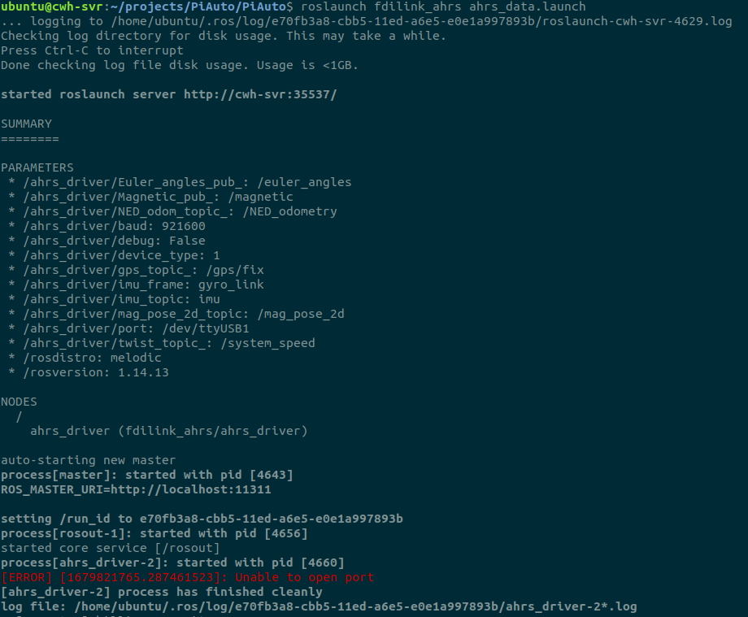
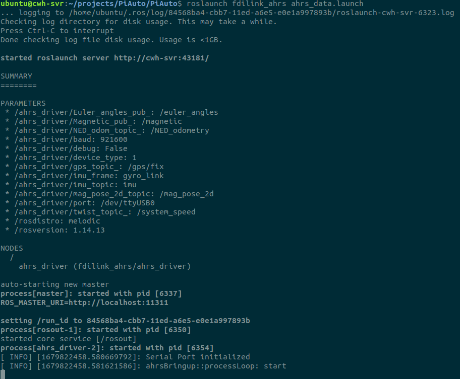

## 设置port

遇到Unable to open port


1. 首先，需要确认ahrs_data.launch里面port值

使用lsusb查看imu设备，设备名是/dev/ttyUSB0
```
<param name="port"  value="/dev/ttyUSB0"/>
```

2. 修改port值后重新执行依旧是报上面错误

3. usb权限设置

将当前用户加入有usb权限的用户组
```
sudo usermod -a -G dialout $USER_NAME
```
该方式需要重启生效，可自行搜索尝试别的方式

4. 成功连接
